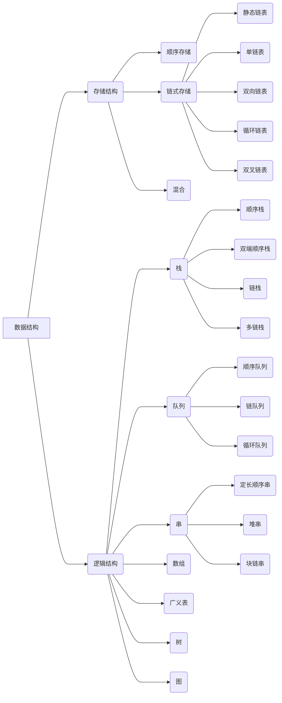

# Learn Data Struct

> 数据结构大纲图示



---

## 一、存储结构

### 1.顺序存储

> 概括：顺序存储就是利用连续的存储空间存储需要的数据元素,在 C 语言中使用数组`elem[]`来存储数据对象,可以是顺序存储的<font color="red">结构体类型</font>,也可以是单个结构体中包含<font color="red">原子类型的顺序存储</font>

示例代码 1：顺序栈（字符）

```c
typedef struct
{
    int top;
    char ch[];//顺序存储
}Stack;
```

> 说明：顺序存储的数据对象在结构体中可以是多种类型的

示例代码 2：哈夫曼树

```c
typedef struct
{
    int weight;
    int parent;
    int LChild;
    int RChild;
}HTNode,Huffmantree[M+1];//顺序存储
```

> 说明：哈夫曼树是树的静态链表存储方式，实质上就树结点结构体的顺序存储,示例 2 用`Huffmantree`字头声明结点数组头指针

### 2.链式存储

> 概括：链式存储是利用非连续的空间存储需要的数据元素，每个节点`struct node Node`使用指针联系，存储空间动态分配

示例代码 1：单链表

```c
typedef struct node
{
    char ch;
    struct node *next//链式存储
}Node,*LinkLint;
```

> 说明： 1.必须有`node`标签用于定义指向节点的指针 2.节点数据类型可以自由选用 3.单链表直线下一个节点的指针，通过它访问下一个节点 4.`Node`用来声明节点类型变量，`LinkList`用于声明指向节点类型指针相当于`Node*`

示例代码 2：二叉树（二叉链表）

```c
typedef struct node
{
    int data;
    struct node *LChild;
    struct node *RChild;//链式存储
}BiTNode,*BiTree;
```

> 说明：`BiTree`用来声明指向树根结点的指针，`BiTNode`用来声明其他结点

### 3.混合

> 概括：混合存储方式是用顺序方式和链式方式并用的存储方式,即多个链表的顺序表，或者多个顺序表的链表

示例代码 1：树（孩子表示法）

```c
typedef struct ChildNode//孩子链表结点定义
{
    int Child;//孩子的位置
    struct ChildNode *next;下一个孩子的指针
}ChildNode;

typedef struct//顺序表结点定义
{
    int data;
    ChildNode *FirstChild;
}DataNode;

typedef struct//树的定义
{
    DataNode nodes[MAX];//多链表头的顺序表
    int roots;
    int num;
}

```

> 说明:树的孩子表示法实际上就是把一个以树的结点之一为开头，孩子节点为后续结点的链表的头用顺序存储表示，即为<font color="red">先链式存储后顺序存储</font>

示例代码 2：图（领接表）

```c
#define MAX_VERTEX_NUM 20
typedef enum//枚举类型，限定数值类型的值表示一种数据
{
    DG,DN,UDG,UDN
} GraphKind;

typedef struct ArcNode//边结点定义
{
    int adjvex;//边指向节点的位置
    struct ArcNode *nextarc;//下一个边结点指针
    int info;//其他边结点信息，例如距离
}ArcNode;

typedef struct VertexNode
{
    char data;
    ArcNode *firstarc;
}VertexNode;

typedef struct
{
    VertexNode vertex[MAX_VERTEX_NUM];//多个顶点加边链表的的顺序存储
    int vexnum,arcnum;//顶点个数，边个数
    GraphKind kind;//表示图类型的枚举
}AdjListGraph;
```

> 说明:实际上就是用图的顶点之一为开头，边为后续的链表的头用顺序表表示，也是<font color="red">先链式存储后顺序存储</font>


