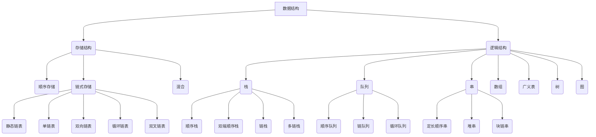

# Learn Data Struct

> 数据结构大纲图示



---

## 一、存储结构

### 1.顺序存储

> 概括：顺序存储就是利用连续的存储空间存储需要的数据元素,通常在 C 语言中使用数组`elem[]`来存储数据对象,可以是结构体,结构体中会有其他标识数据项

示例代码 1：顺序栈（字符）

```c
typedef struct
{
    int top;
    char ch[];
}Stack;
```

> 顺序存储的数据对象在结构体中可以是多种类型的

| top->    | data |
| -------- | ---- |
| /        | /    |
| /        | /    |
| **栈底** | /    |

示例代码 2：哈夫曼树

```c
typedef struct
{
    int weight;
    int parent;
    int LChild;
    int RChild;
}HTNode,Huffmantree[M+1];
```

> 哈夫曼树是树的静态链表存储方式，实质上就是树结点结构结构体的顺序存储,示例 2 用`Huffmantree`字头声明结点数组头指针

### 2.链式存储

> 概括：链式存储是利用非连续的空间存储需要的数据元素，每个节点`struct node Node`使用指针联系，存储空间动态分配

示例代码 1：单链表

```c
typedef struct node
{
    char ch;
    struct node *next
}Node,*LinkLint;
```

> 1.必须有`node`标签用于定义指向节点的指针 2.节点数据类型可以自由选用 3.单链表直线下一个节点的指针，通过它访问下一个节点 4.`Node`用来声明节点类型变量，`LinkList`用于声明指向节点类型指针相当于`Node*`

示例代码 2：二叉树

```c
typedef struct node
{
    int data;
    struct node *LChild;
    struct node *RChild;
}
```
