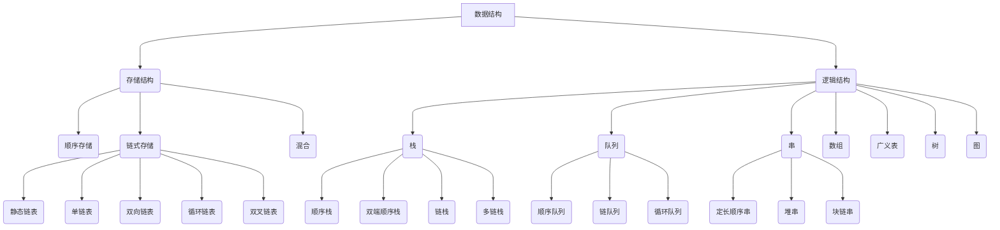

# Learnc
>数据结构大纲图示

```mermaid
graph BR
A[数据结构] 
A--->B1(存储结构)
A--->B2(逻辑结构)

B1--->B11(顺序存储)
B1--->B12(链式存储)
B1--->B13(混合)
B2--->B21(栈)
B2--->B22(队列)
B2--->B23(串)
B2--->B24(数组)
B2--->B25(广义表)
B2--->B26(树)
B2--->B27(图)

B12--->B120(静态链表)
B12--->B121(单链表)
B12--->B122(双向链表)
B12--->B123(循环链表)
B12--->B124(双叉链表)

B21--->B211(顺序栈)
B21--->B212(双端顺序栈)
B21--->B213(链栈)
B21--->B214(多链栈)

B22--->B221(顺序队列)
B22--->B222(链队列)
B22--->B223(循环队列)

B23--->B231(定长顺序串)
B23--->B232(堆串)
B23--->B233(块链串)


```

