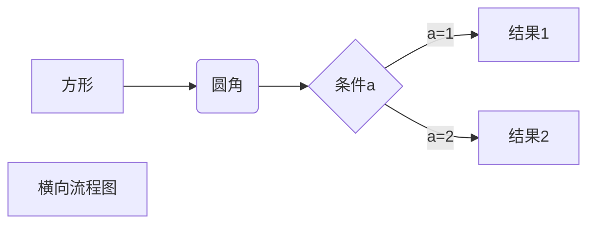

| First Header | Second Header |
| ------------ | ------------- |
| Content Cell | Content Cell  |
| Content Cell | Content Cell  |

$$
\begin{Bmatrix}
   a & b \\
   c & d
\end{Bmatrix}
$$
$$
\begin{CD}
   A @>a>> B \\
@VbVV @AAcA \\
   C @= D
\end{CD}
$$

$$
\overbrace{0,0,\dots,0}^{\text{共n项}}
\underbrace{0,0,\dots,0}_{n}
$$
$$
\frac{分子}{分母}
$$
$$
\begin{equation}
a+b=c 
\end{equation}
$$
$$
1/(a+b)^{sd}
$$
$$
A=\begin{pmatrix}
1&2&3\\
4&5&6\\
7&8&9\\
\end{pmatrix}
$$
$$
A=\begin{pmatrix}
1&\dots&3\\
&\ddots&\vdots\\
7&8&9\\
\end{pmatrix}\\
\mathbf{X}
\mathrm{e}
\mathrm{i}
\int_{2}^{3} f(x) \,\,\,\,\,\,\mathrm{d} x\\
\begin{gather}
a+b=c\\
c+d=e\notag
\end{gather}\\

f(x)=\begin{dcases}
1,&x=1\\
0,&x \not= 1
\end{dcases}\\

\lim_{x \to  \infty} \exp(-x) = 0
$$